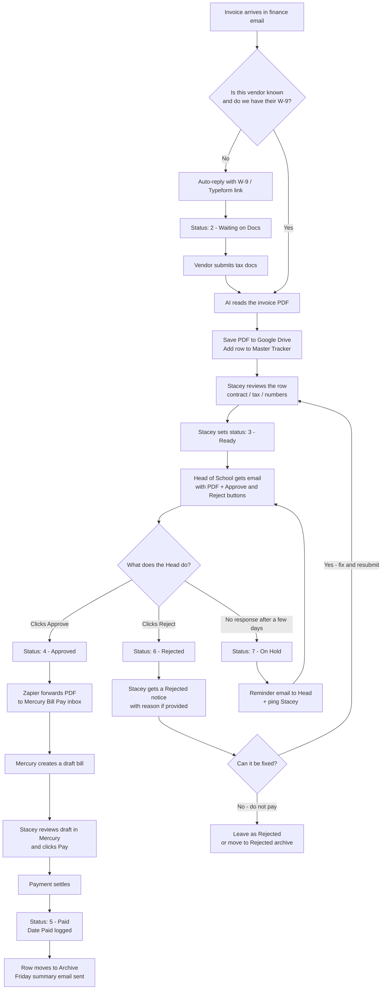

# Vendor Invoice Approval Workflow

Plain-English process for finance intake → approval → Mercury payment.

**People involved**
- **Automation (Zapier):** does the filing, emails, and status updates
- **Stacey:** compliance check + final Pay in Mercury
- **Head of School:** Approve or Reject

---

## Statuses used in the Sheet

| Status | Meaning |
|---|---|
| `1 - Intake` | New invoice landed; being processed |
| `2 - Waiting on Docs` | Vendor needs to send W-9 / tax form |
| `3 - Ready` | Stacey reviewed it; waiting on Head of School |
| `4 - Approved` | Head approved; sent to Mercury |
| `5 - Paid` | Mercury payment settled |
| `6 - Rejected` | Head rejected; waiting on Stacey / vendor to fix |
| `7 - On Hold` | Head never responded; needs a follow-up |

---

## Full flow diagram



---

## Swimlane version (who does what)

```text
INVOICE EMAIL
      │
      ▼
┌─────────────────────────────────────┐
│ AUTOMATION                          │
│ • Checks vendor / W-9               │
│ • Sends tax form if needed          │
│ • Reads invoice with AI             │
│ • Saves PDF + creates Sheet row     │
└─────────────────┬───────────────────┘
                  │
                  ▼
┌─────────────────────────────────────┐
│ STACEY                              │
│ • Quick Sheet review                │
│ • Sets status to "3 - Ready"        │
└─────────────────┬───────────────────┘
                  │
                  ▼
┌─────────────────────────────────────┐
│ HEAD OF SCHOOL                      │
│ • Clicks Approve  OR  Reject        │
│   (email has both buttons)          │
└────────────┬────────────┬───────────┘
             │            │
     Approve │            │ Reject
             ▼            ▼
┌──────────────────┐  ┌──────────────────────────────┐
│ AUTOMATION       │  │ AUTOMATION                   │
│ • Status:        │  │ • Status: 6 - Rejected       │
│   4 - Approved   │  │ • Emails Stacey              │
│ • Forward PDF to │  │ • Does NOT send to Mercury   │
│   Mercury inbox  │  └──────────────┬───────────────┘
└────────┬─────────┘                 │
         │                           ▼
         ▼                ┌──────────────────────────────┐
┌──────────────────┐      │ STACEY                       │
│ MERCURY          │      │ • Fixes issue / asks vendor  │
│ • Builds draft   │      │ • Or closes as do-not-pay    │
└────────┬─────────┘      │ • If fixed: set back to      │
         │                │   Ready and re-send approval │
         ▼                └──────────────────────────────┘
┌──────────────────┐
│ STACEY           │
│ • Checks draft   │
│ • Clicks Pay     │
└────────┬─────────┘
         │
         ▼
┌──────────────────┐
│ AUTOMATION       │
│ • Marks Paid     │
│ • Archives row   │
│ • Friday summary │
└──────────────────┘
```

---

## If it is NOT approved

The approval email always has two buttons: **Approve** and **Reject**.

### If the Head clicks Reject
1. Sheet status becomes **`6 - Rejected`** (timestamped).
2. Zapier emails Stacey: vendor, amount, invoice #, PDF link, and any reject reason.
3. **Nothing is sent to Mercury.** No draft bill is created.
4. Stacey decides next step:
   - **Fixable** (wrong amount, missing contract note, etc.) → update the row / get a corrected invoice → set status back to **`3 - Ready`** → Head gets a fresh approval email.
   - **Not payable** → leave as Rejected (or move to a Rejected archive tab).

### If the Head never clicks anything
1. After a set number of days (suggested: **3 business days**), status becomes **`7 - On Hold`**.
2. Automation sends a reminder to the Head and notifies Stacey.
3. Stacey can nudge the Head, or pull it back if the invoice should wait.

### Important rule
**Rejected and On Hold invoices never go to Mercury.** Only status **`4 - Approved`** triggers the Mercury Bill Pay forward.

---

## Who does what (summary)

| Step | Who | What they do |
|---|---|---|
| Intake & filing | Automation | Reads email, checks vendor, sends W-9 if needed, extracts invoice data, saves PDF, creates Sheet row |
| Compliance | Stacey | Reviews the row, flips status to Ready |
| Approval | Head of School | Clicks **Approve** or **Reject** in the email |
| If rejected | Stacey | Fixes / follows up with vendor, or closes as do-not-pay |
| Bill draft | Automation + Mercury | Only after Approve: forwards PDF to Mercury; Mercury builds the draft |
| Payment | Stacey | Reviews draft in Mercury and pays |
| Close-out | Automation | Marks Paid, logs date, archives, sends Friday summary |

---

## Bottom line for Stacey

You mainly do two things on a normal invoice:
1. Green-light the Sheet row after a quick check.
2. Hit Pay in Mercury after a final look.

If the Head **rejects**, you get an email instead of a Mercury draft — then you either fix and resubmit for approval, or close it out as not payable.
