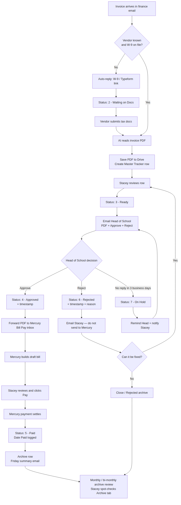
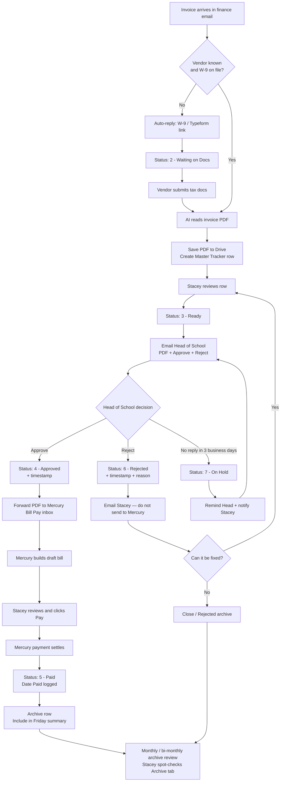

# Vendor Invoice Approval Workflow

Plain-English process for finance intake → approval (or rejection) → Mercury payment → archive review.

**People involved**
- **Automation (Zapier):** filing, emails, status updates, Mercury forward, reminders
- **Stacey:** compliance check + final Pay in Mercury (and handling rejects) + archive review
- **Head of School:** Approve or Reject

---

## Statuses used in the Sheet

| Status | Meaning | Goes to Mercury? |
|---|---|---|
| `1 - Intake` | New invoice landed; being processed | No |
| `2 - Waiting on Docs` | Vendor needs to send W-9 / tax form | No |
| `3 - Ready` | Stacey reviewed it; waiting on Head of School | No |
| `4 - Approved` | Head approved; PDF forwarded to Mercury | Yes |
| `5 - Paid` | Mercury payment settled | Already there |
| `6 - Rejected` | Head rejected; Stacey must fix or close | No |
| `7 - On Hold` | Head never responded; needs a follow-up | No |

**Hard rule:** only status **`4 - Approved`** triggers the Mercury Bill Pay forward.

---

## Full flow diagram

**Shareable image:** [PNG](./invoice-workflow-diagram.png) · [SVG](./invoice-workflow-diagram.svg)



### Text version

```text
                         [ INVOICE SENT TO FINANCE EMAIL ]
                                          │
                                          ▼
                               [ ZAPIER SMART CHECK ]
                                          │
              ┌───────────────────────────┴───────────────────────────┐
              ▼                                                       ▼
   [ NEW VENDOR / MISSING TAX ]                          [ KNOWN VENDOR W/ W-9 ]
              │                                                       │
              ▼                                                       │
   Auto-Reply: W-9 / Typeform Link                                    │
              │                                                       │
              ▼                                                       │
   Sheet Status: "2 - Waiting on Docs"                                │
              │                                                       │
              ▼                                                       │
   Vendor Submits Tax Docs via Form                                   │
              │                                                       │
              └───────────────────────────┬───────────────────────────┘
                                          │
                                          ▼
                            [ AI DATA EXTRACTION PARSER ]
                 Extracts Vendor Name, Invoice #, Amount, & Due Date
                                          │
                                          ▼
                          [ GOOGLE DRIVE + GOOGLE SHEETS ]
               Saves PDF to Drive ──> Creates Row in Master Tracker
                                          │
                                          ▼
                         [ STACEY'S COMPLIANCE REVIEW ]
               Verifies Contract/Data ──> Updates Status: "3 - Ready"
                                          │
                                          ▼
                    [ AUTOMATED HEAD OF SCHOOL EMAIL ]
              Contains PDF Link + "APPROVE" Button + "REJECT" Button
                                          │
                    ┌─────────────────────┼─────────────────────┐
                    ▼                     ▼                     ▼
           [ HEAD CLICKS           [ HEAD CLICKS        [ NO REPLY AFTER
             APPROVE ]               REJECT ]            ~3 BUSINESS DAYS ]
                    │                     │                     │
                    ▼                     ▼                     ▼
        Status: "4 - Approved"   Status: "6 - Rejected"   Status: "7 - On Hold"
           (+ timestamp)          (+ timestamp/reason)     Reminder to Head
                    │                     │                 + notify Stacey
                    ▼                     ▼                     │
   [ ZAPIER FORWARDS PDF TO      [ EMAIL STACEY ]               │
      MERCURY BILL PAY INBOX ]    Do NOT send to Mercury         │
                    │                     │                     │
                    ▼                     ▼                     │
        [ MERCURY CREATES           Can it be fixed?             │
           DRAFT BILL ]                   │                     │
                    │           ┌─────────┴─────────┐           │
                    ▼           ▼                   ▼           │
   [ STACEY REVIEWS & PAYS   YES: Stacey fixes   NO: Close as   │
          IN MERCURY ]       → set "3 - Ready"   do-not-pay /   │
                    │        → re-send approval  Rejected       │
                    ▼              email                 archive │
   [ MERCURY PAYMENT SETTLES ]         │                        │
                    │                  └──────────►─────────────┘
                    ▼                           (loops back to
   Status: "5 - Paid" + Date Paid            Head email if Ready)
                    │
                    ▼
          [ AUTO-ARCHIVE + WEEKLY DIGEST ]
     Row moves to Archive ──> Friday Summary Email
                    │
                    ▼
     [ MONTHLY / BI-MONTHLY ARCHIVE REVIEW ]
   Zapier reminds Stacey to check Archive tab
   Spot-check paid invoices, reject closes,
   and anything that looks off ──> note / escalate
```



---

## Who does what (including not approved + archive review)

```text
INVOICE EMAIL
      │
      ▼
┌──────────────────────────────────────┐
│ AUTOMATION                           │
│ • Checks vendor / W-9                │
│ • Sends tax form if needed           │
│ • Reads invoice with AI              │
│ • Saves PDF + creates Sheet row      │
└──────────────────┬───────────────────┘
                   │
                   ▼
┌──────────────────────────────────────┐
│ STACEY                               │
│ • Quick Sheet review                 │
│ • Sets status to "3 - Ready"         │
└──────────────────┬───────────────────┘
                   │
                   ▼
┌──────────────────────────────────────┐
│ HEAD OF SCHOOL                       │
│ Email has two buttons:               │
│   [ APPROVE ]     [ REJECT ]         │
└───────┬──────────────────┬───────────┘
        │                  │
 Approve│                  │Reject
        ▼                  ▼
┌─────────────────┐  ┌─────────────────────────────┐
│ AUTOMATION      │  │ AUTOMATION                  │
│ Status:         │  │ Status: 6 - Rejected        │
│ 4 - Approved    │  │ Email Stacey with reason    │
│ Forward PDF to  │  │ Do NOT send to Mercury      │
│ Mercury inbox   │  └──────────────┬──────────────┘
└────────┬────────┘                 │
         │                          ▼
         ▼               ┌─────────────────────────────┐
┌─────────────────┐      │ STACEY                      │
│ MERCURY         │      │ • Fix + set Ready again     │
│ Builds draft    │      │   (re-sends approval email) │
└────────┬────────┘      │ • Or close as do-not-pay    │
         │               └─────────────────────────────┘
         ▼
┌─────────────────┐
│ STACEY          │
│ Checks draft    │
│ Clicks Pay      │
└────────┬────────┘
         │
         ▼
┌─────────────────┐
│ AUTOMATION      │
│ Marks Paid      │
│ Archives row    │
│ Friday summary  │
└────────┬────────┘
         │
         ▼
┌──────────────────────────────────────┐
│ STACEY — MONTHLY / BI-MONTHLY        │
│ Archive review (Zapier reminder)     │
│ • Spot-check paid invoices           │
│ • Review rejected / closed items     │
│ • Flag anything that looks wrong     │
└──────────────────────────────────────┘

If Head never clicks either button:
  Automation → Status 7 - On Hold → reminder to Head + notify Stacey
```

---

## What happens if it is NOT approved

### Head clicks Reject
1. Sheet → **`6 - Rejected`** (timestamp + optional reason).
2. Stacey gets an email with vendor, amount, invoice #, PDF link, and reason.
3. **No Mercury draft.** Nothing is forwarded.
4. Stacey either:
   - **Fixes it** (corrected invoice / missing info) → set status back to **`3 - Ready`** → Head gets a new approval email, or
   - **Closes it** as do-not-pay → leave Rejected / move to Rejected archive.

### Head never clicks anything
1. After **3 business days** → status **`7 - On Hold`**.
2. Reminder email to Head + notify Stacey.
3. Stacey can nudge, wait, or pull the invoice back.

---

## Monthly / bi-monthly archive review

After invoices are paid (or closed as rejected), they sit in the Archive tab. On a **monthly or bi-monthly** cadence:

1. Zapier sends Stacey a reminder email with a link to the Archive tab.
2. Stacey spot-checks recent archived rows:
   - Paid amounts look right
   - Vendor / invoice # matches
   - Rejected closes make sense
   - Nothing stuck that should have been paid
3. If something looks off → note it in the Sheet / escalate (vendor, Head, or Mercury).

Suggested cadence: **1st of every month**, or **1st and 15th** for bi-monthly.

---

## Suggested Sheet columns

| Column | Purpose |
|---|---|
| A – Date Received | When email landed |
| B – Vendor | From AI / email |
| C – Invoice # | From AI |
| D – Amount | From AI |
| E – Due Date | From AI |
| F – Drive Link | PDF in Google Drive |
| G – Status | 1–7 status values above |
| H – Tax / W-9 OK? | Yes / No |
| I – Approved At | Timestamp when Head approved |
| J – Rejected At | Timestamp when Head rejected |
| K – Reject Reason | Optional note from reject link |
| L – Date Paid | From Mercury settlement |
| M – Row ID | Stable ID used in Approve/Reject links |
| N – Last Archive Review | Date Stacey last reviewed this period (optional) |

---

## Zapier build (separate Zaps)

### Zap 1 — Intake
- **Trigger:** New email in finance inbox (PDF attachment)
- **Lookup** vendor in Sheet / vendor directory
- **Path A — missing tax:** reply with Typeform/W-9 link → create/update row → status `2`
- **Path B — tax OK:** continue to parse

### Zap 2 — Tax form received
- **Trigger:** Typeform submission
- Mark vendor W-9 complete
- If a waiting invoice exists for that vendor → move it forward to parse / notify Stacey

### Zap 3 — Parse + file
- AI extract: vendor, invoice #, amount, due date
- Upload PDF to Drive
- Create Sheet row (status `1` or ready for Stacey review)
- Deduplicate on vendor + invoice #

### Zap 4 — Ready → ask Head
- **Trigger:** Sheet status becomes `3 - Ready`
- Email Head of School with:
  - Vendor, amount, invoice #, due date, Drive PDF link
  - **Approve** link → Catch Hook `?decision=approve&row_id=...`
  - **Reject** link → Catch Hook `?decision=reject&row_id=...` (optional reason field / separate reject hook)

### Zap 5 — Decision webhook (Approve or Reject)
- **Trigger:** Webhooks Catch Hook
- **If Approve:**
  - Update row → `4 - Approved` + Approved At
  - Email/forward the PDF to Mercury Bill Pay inbox
- **If Reject:**
  - Update row → `6 - Rejected` + Rejected At (+ reason)
  - Email Stacey
  - **Do not** contact Mercury

### Zap 6 — No response / On Hold
- **Trigger:** Schedule (daily)
- Find rows still at `3 - Ready` older than 3 business days
- Set `7 - On Hold`
- Remind Head + notify Stacey

### Zap 7 — Paid
- **Trigger:** Mercury Settled Transaction
- Match Sheet row (amount / vendor / memo / invoice #)
- Status `5 - Paid` + Date Paid
- Move to Archive tab

### Zap 8 — Friday digest
- **Trigger:** Every Friday
- Email summary of Paid / Rejected / On Hold / still Ready this week

### Zap 9 — Monthly / bi-monthly archive review reminder
- **Trigger:** Schedule (1st of month, or 1st + 15th)
- Email Stacey: link to Archive tab + short checklist
  - Spot-check paid invoices
  - Review rejected / closed items
  - Flag anything that looks wrong
- Optional: log “Last Archive Review” date on the Sheet

---

## Bottom line for Stacey

**Normal invoice**
1. Review the Sheet row → set **Ready**
2. Later, review the Mercury draft → click **Pay**

**If the Head rejects**
- You get an email, not a Mercury draft
- Fix and set Ready again, or close it as do-not-pay

**If the Head goes silent**
- Row goes On Hold and you get a ping so it doesn’t disappear

**Once a month (or twice a month)**
- Open the Archive tab when the reminder hits
- Quick spot-check that paid / rejected items look right
